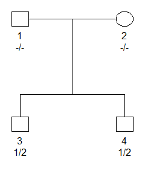

<!-- README.md is generated from README.Rmd. Please edit that file -->

# pedprobr 

<!-- badges: start -->

[](https://CRAN.R-project.org/package=pedprobr)
[](https://cran.r-project.org/package=pedprobr)
[](https://cran.r-project.org/package=pedprobr)
<!-- badges: end -->

## Introduction

The main content of **pedprobr** is an implementation of the
Elston-Stewart algorithm for pedigree likelihoods. It is a reboot of the
implementation in
[paramlink](https://CRAN.R-project.org/package=paramlink) which is no
longer actively developed.

**pedprobr** is part of the *ped suite*, a collection of packages for
pedigree analysis in R, based on
[pedtools](https://github.com/magnusdv/pedtools) for basic handling of
pedigrees and marker data. In particular, **pedprobr** does much of the
hard work in the [forrel](https://github.com/magnusdv/forrel) package
for relatedness analysis and forensic pedigree analysis.

The workhorse of the **pedprobr** package is the `likelihood()`
function, which works in a variety of situations:

-   complex inbred pedigrees
-   pedigrees with inbred founders
-   autosomal and X-linked markers
-   a single marker or two linked markers
-   markers with mutation models (supported by
    [pedmut](https://github.com/magnusdv/pedmut))

## Installation

To get the current official version of **pedprobr**, install from CRAN
as follows:

``` r
install.packages("pedprobr")
```

Alternatively, you can obtain the latest development version from
GitHub:

``` r
# install.packages("devtools") # install devtools if needed
devtools::install_github("magnusdv/pedprobr")
```

## Getting started

``` r
library(pedprobr)
#> Loading required package: pedtools
```

To set up a simple example, we first use **pedtools** utilities to
create a pedigree with a single attached marker object. The marker has
alleles `a` and `b`, with frequencies 0.2 and 0.8 respectively, and both
brothers are heterozygous.

``` r
# Pedigree
x = nuclearPed(nch = 2)

# Marker
m = marker(x, geno = c(NA, NA, "a/b", "a/b"), afreq = c(a = 0.2, b = 0.8))

# Plot
plot(x, marker = m)
```



The pedigree likelihood, i.e., the probability of observing these
genotypes in the given pedigree, is obtained as follows:

``` r
likelihood(x, marker = m)
#> [1] 0.1856
```

## Genotype probability distributions

Besides `likelihood()` the most important functions in **pedprobr** are:

-   `oneMarkerDistribution()` : for a subset of family members, compute
    their joint genotype distribution at a single marker
-   `twoMarkerDistribution()` : for a single family member, compute the
    joint genotype distribution at two linked markers

In both cases, the distributions are computed conditionally on any known
genotypes at the markers in question.

To illustrate `oneMarkerDistribution()` we continue our example from
above, and consider the following question: *What is the joint genotype
distribution of the parents, conditional on the genotypes of the
children?*

The answer is found as follows:

``` r
oneMarkerDistribution(x, ids = 1:2, partialmarker = m, verbose = F)
#>            a/a        a/b       b/b
#> a/a 0.00000000 0.01724138 0.1379310
#> a/b 0.01724138 0.13793103 0.2758621
#> b/b 0.13793103 0.27586207 0.0000000
```

For example, the output confirms the intuitive result that the parents
cannot both be homozygous for the same allele. The most likely
combination is that one parent is heterozygous `a/b`, while the other is
homozygous `b/b`.
