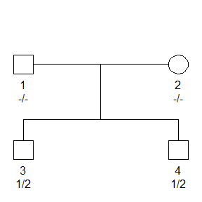

<!-- README.md is generated from README.Rmd. Please edit that file -->
pedprobr
========

`pedprobr` is a reboot of the computational heart of the retired `paramlink` package. Its main content is an implemention of the Elston-Stewart algorithm for pedigree likelihoods. It is part of a suite of packages for pedigree analysis in R, all using `pedtools` for basic handling of pedigrees and markers.

The workhorse of the package is the `likelihood()` function, which works in a variety of situations:

-   complex pedigrees with multiple layers inbreeding
-   autosomal and X-linked markers
-   a single marker or two linked markers
-   markers with mutation models

Installation
------------

To get the latest version of `pedprobr`, install from GitHub as follows:

``` r
 # First install devtools if needed
if(!require(devtools)) install.packages("devtools")

# Install pedprobr from github
devtools::install_github("magnusdv/pedprobr")
```

Getting started
---------------

``` r
library(pedtools)
library(pedprobr)
```

For a simple example, we first create (with `pedtools`) a pedigree and attach to it a marker object. The marker is a diallelic SNP, and the two brothers are both heterozygous.

``` r
x = nuclearPed(nch = 2)
m = marker(x, '3' = 1:2, '4' = 1:2)

x = addMarkers(x, m) # attach the marker
x
#>  id fid mid sex <1>
#>   1   *   *   1 -/-
#>   2   *   *   2 -/-
#>   3   1   2   1 1/2
#>   4   1   2   1 1/2

plot(x, m)
```



The pedigree likelihood is computed as follows:

``` r
likelihood(x, marker1 = 1)
#> [1] 0.3125
```

Besides `likelihood()` the most important functions in `probedr` are `oneMarkerDistribution()` and `twoMarkerDistribution()`. For a quick illustration of the former, we compute the joint genotype probability distribution of parents, conditional on the children.

``` r
oneMarkerDistribution(x, ids = 1:2, partialmarker = 1)
#> Partial marker (autosomal):
#>    <NA>
#>  1  -/-
#>  2  -/-
#>  3  1/2
#>  4  1/2
#> -------- 
#> Chrom NA: NA (Mb), NA (cM)
#> Mutations possible: No 
#> Allele frequencies:
#>    1   2
#>  0.5 0.5
#> ==============================
#> 
#> Analysis finished in  0.02  seconds
#> 
#> Joint genotype probability distribution for individuals 1, 2:
#>     1/1 2/2 1/2
#> 1/1 0.0 0.2 0.1
#> 2/2 0.2 0.0 0.1
#> 1/2 0.1 0.1 0.2
```
